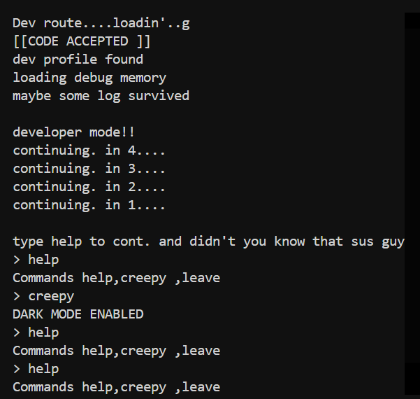
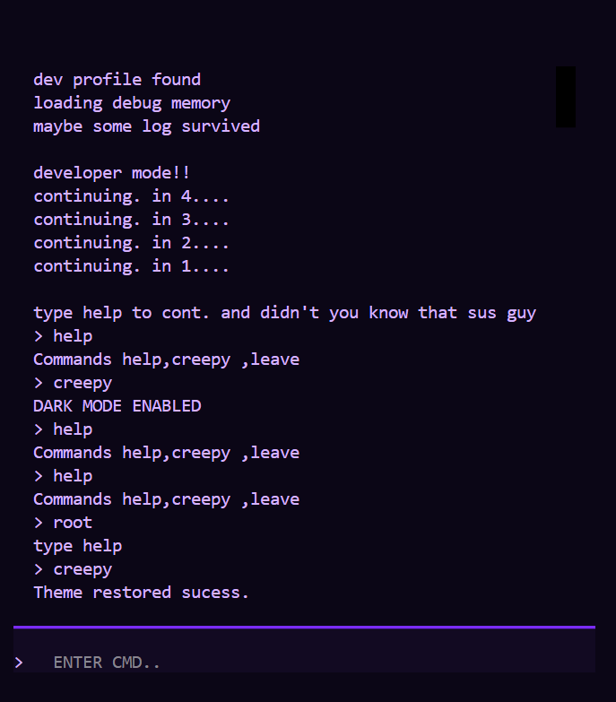

## Aitrap2d

It is a terminal game which runs in your terminal and it follows command based solving method to progress.It is part 2 of my game Aitrap1d so most of the feature comes from it but i changed many  things and added some new things too.

# TECH BEHIND IT

BUILT USING THE TEXTUAL LIBRARY

USED PYTHON MAINLY WITH CSS SO IT DONT LOOK LIKE BORING ONE.

I ALSO USED TERMINAL WAYS FOR IT BETTER LAYOUT.

## DASHBOARD

## CREEPY COOL DASHBOARD

## MY LEARNING

NOT SPECIFICALLY JUST A SEQUEL SO I ALREADY AM GOOD IN TEXTUAL AND PYTHON

## VIDEO TUTORIAL(PLEASE WATCH IF YOU R A REVIEWER)

## running

JUST DOWNLOAD THE EXECUTABLE FILE OR CLONE REPO THEN RUN __ app.py

## REQUIREMENTS-
TEXTUAL-8.2.7 INSTALLED OR YOU CAN FACE CSS  ISSUE 
via-pip install textual

3.PYTHON 3.10+

# GOALS-
PART 3 SOON THAT'LL BE ENDLESS

# THINGS TO NOTE-

IF A REVIEWER I HAVE GIVEN YOU ENTRY CODE IN PROJECT DESCRIPTION

IF A PERSON TRYING GAME TRY Aitrap1d first you will automatically get the code

# MY AI USAGE
THOUGH, I AM WELL VERSED IN MAKING TERMINAL GAMES STILL I USED AI FOR DEBUG 2 TO 3 TIMES LIKE I GOT PROBLEMS BECAUSE OF SINGLE SEMICOLON:

## SPECIAL THANKS ALCHEMIZE 

## THEME SELECTION REASON(IGNORE IF NOT ALCHINSPECTOR)

IT MATCHES 2 SIMULTANEOUS THEME INDIE GAMEDEV AND NO INTERNET BUT AS IT IS TERMINAL BASED AND WORK OFFLINE SO NO INTERNET IS A GOOD CHOICE AND STORY REFERENCE TOO

# HOW TO PLAY
How to Play

Run the file in a terminal: python filename.py
It'll ask for a code from Part 1. Enter it (format like DEV-1234-P2).
Watch the intro load, then a 4-second countdown. Once it's done, type help to see basic commands.

Your starting level depends on your code:

DEV → Level 1
ROOT → Level 2
AIRL → Level 3
CORE → Level 4
SYS → Level 5

Level 1 (DEV):

Type bug to see a broken piece of code.
Type hint if you're stuck (limited hints).
Type fix range to solve it and move to Level 2.

Level 2 (ROOT):

Type perms to see a file with bad permissions.
Type hint if needed.
Type fix 700 to lock it down and move to Level 3.

Level 3 (AIRL) — two rounds:

Type sync to get a number sequence.
Type hint if needed.
Type answer 32 to solve the first one.
You'll get a second sequence — type answer 8 to solve it and move to Level 4.

Level 4 (CORE):

Type log to see an encoded fragment.
Type hint if needed.
Type decode core to solve it and move to Level 5.

Level 5 (SYS):

Type riddle to get the final puzzle.
Type hint if needed.
Type answer keyboard to solve it.

Level 6 — the ending:
You'll get three choices. Type one of:

1 or wait for part 3
2 or finish and see ending
3 or shutdown

Each gives you a different ending message plus a new code for Part 3 — save it.
Other commands that work anytime:

help — command list
creepy — toggles dark mode
clear — clears the screen
leave — quits the game
A few hidden easter eggs too (LIKE CAT) — just for fun, they don't affect progress.
Want to be notified when 

# THANKS A LOT
p.s-try some easter egg too view the source code for reference nd this code should help DEV-1234-P2
